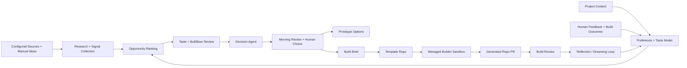

# Forge

Forge is a planned product-first agent system. It helps people create and iterate on products by watching configured product inputs, researching the market, debating opportunities, learning the user's taste, and turning approved directions into prototypes or PR-ready MVPs.

This repository is currently an early scaffold. It now contains a first-pass Google ADK ingestion agent for collecting social and repository pain signals into Supabase, but it does not yet contain the managed builder integration, dashboard, or template repo automation.

## Target Shape

The intended v1 flow supports two starting modes:

- Connected product: the user connects an existing product, repo, feedback source, issue tracker, competitor set, or public search topic.
- New product: the user starts from a theme, idea, target user, or sample project context that Forge can research and prototype from.

The common loop is:

1. User defines product context, source configs, triggers, and an explicit preference profile.
2. Forge ingests manual ideas, feedback, public signals, repo signals, web/social research, or scheduled source scans.
3. Forge ranks opportunities against the product context, preference profile, evidence, feasibility, novelty, and observed user behavior.
4. Taste critique and parallel Bull/Bear review challenge the strongest opportunities.
5. A Decision Agent recommends whether to watch, research more, prototype, build, or reject.
6. The user reviews a product briefing and approves a direction, not a full implementation plan.
7. Forge can generate inline prototype options, or create a generated repo from a minimal MVP template repo.
8. A managed Antigravity sandbox agent builds a runnable prototype or PR-ready MVP using the stack that fits the opportunity.
9. Forge surfaces reviewed artifacts: generated UI, repo or PR URL, README, tests or smoke checks, run instructions, and decision history.
10. Forge reflects on human feedback, failures, ignored suggestions, and build outcomes to improve its own memory, rubrics, skills, and trigger policies for future runs.

## Proposed Components

## Constraints

- Generated MVPs may be separate repos created from a template repo, but inline generated UI and lightweight prototypes are valid earlier artifacts.
- V1 allows code, local execution, generated UI, and free services only.
- No paid APIs, production deploys, or secret-requiring integrations without a later approval step.
- Antigravity is treated as an external managed sandbox capability; this repo should model its inputs, outputs, statuses, and logs without assuming local execution.
- Keep source attribution, product context, human feedback, decision rationale, and build outcomes structured and visible.
- Treat Forge self-improvement as versioned memory, rubric, skill, prompt, and policy changes. Do not silently rewrite high-risk behavior.
- Verify Google ADK, Vertex AI Agent Engine, and Antigravity implementation details against current official docs at implementation time.
- Do not put service-role keys, source API credentials, or generated-repo secrets in frontend code.

## Docs For Future Agents

- [Goal](./GOAL.md)
- [Agent Instructions](./AGENTS.md)
- [Claude Instructions](./CLAUDE.md)
- [Execution Plan](./PLAN.md)
- [Architecture](./docs/ARCHITECTURE.md)
- [Data Model](./docs/DATA_MODEL.md)
- [Prompt Contracts](./docs/prompts/AGENT_PROMPTS.md)
- [Open Questions](./docs/OPEN_QUESTIONS.md)
- [Ingestion Agent](./services/ingestion_agent/README.md)
