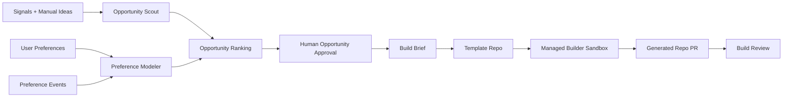

# Forge

Forge is a planned preference-aware MVP builder. It discovers product opportunities from public developer pain signals and user preferences, then launches a managed sandbox agent to build a PR-ready MVP in a separate generated repository.

This repository is currently a project scaffold. It does not yet contain a working ingestion pipeline, managed builder integration, database migration, dashboard, or template repo automation.

## Target Shape

The intended v1 flow is:

1. User defines an explicit preference profile.
2. Forge ingests or receives product opportunity signals.
3. Forge ranks opportunities against the profile and observed user behavior.
4. User approves an opportunity, not a full implementation plan.
5. Forge creates a generated repo from a minimal MVP template repo.
6. A managed Antigravity sandbox agent builds a runnable MVP using the stack that fits the opportunity.
7. Forge surfaces a PR-ready app with README, tests or smoke checks, and run instructions.

## Proposed Components

## Constraints

- Generated MVPs are separate repos created from a template repo.
- V1 allows code and free services only.
- No paid APIs, production deploys, or secret-requiring integrations without a later approval step.
- Antigravity is treated as an external managed sandbox capability; this repo should model its inputs, outputs, statuses, and logs without assuming local execution.
- Keep source attribution structured and visible for opportunity recommendations.
- Verify Google ADK, Vertex AI Agent Engine, and Antigravity implementation details against current official docs at implementation time.
- Do not put service-role keys, source API credentials, or generated-repo secrets in frontend code.

## Docs For Future Agents

- [Goal](./GOAL.md)
- [Agent Instructions](./AGENTS.md)
- [Claude Instructions](./CLAUDE.md)
- [Execution Plan](./PLAN.md)
- [Architecture](./docs/ARCHITECTURE.md)
- [Data Model](./docs/DATA_MODEL.md)
- [Prompt Contracts](./docs/prompts/AGENT_PROMPTS.md)
- [Open Questions](./docs/OPEN_QUESTIONS.md)
