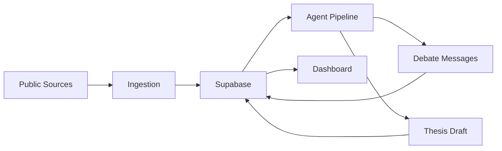

# Forge

Forge is a planned agentic research system for turning public developer pain signals into startup thesis drafts.

This repository is currently a project scaffold. It does not yet contain a working ingestion pipeline, agent service, database migration, or dashboard.

## Target Shape

The intended vertical slice is:

1. Collect a small number of public developer signals from reliable sources.
2. Normalize and store those signals.
3. Select one candidate opportunity.
4. Run a bounded Bull vs. Bear critique loop.
5. Produce a sourced thesis draft as Markdown plus structured JSON.
6. Display stored theses and debate messages in a dashboard.

## Proposed Components

## Constraints

- Treat generated theses as research drafts, not validated investment advice.
- Keep source attribution structured and visible.
- Build local execution before cloud deployment.
- Verify Google ADK and Vertex AI Agent Engine implementation details against current official docs at implementation time.
- Do not put service-role keys or source API credentials in frontend code.

## Docs For Future Agents

- [Goal](./GOAL.md)
- [Agent Instructions](./AGENTS.md)
- [Claude Instructions](./CLAUDE.md)
- [Execution Plan](./PLAN.md)
- [Architecture](./docs/ARCHITECTURE.md)
- [Data Model](./docs/DATA_MODEL.md)
- [Prompt Contracts](./docs/prompts/AGENT_PROMPTS.md)
- [Open Questions](./docs/OPEN_QUESTIONS.md)
