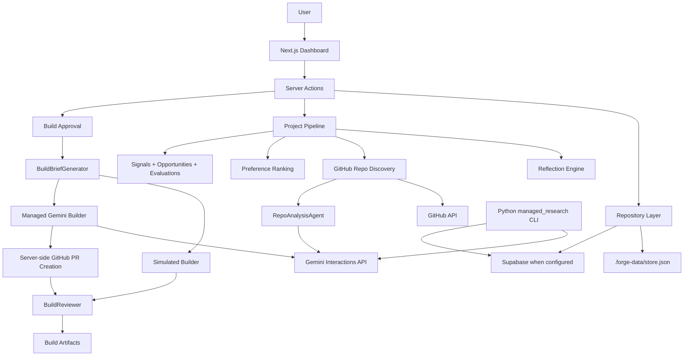

# Architecture

This document separates the architecture that exists now from the target architecture Forge is growing toward.

## Current Implementation

Forge currently has four working layers:

1. Dashboard app: `apps/dashboard`
2. Data repository layer: local JSON store plus optional Supabase access
3. Managed/repo agent integrations: GitHub discovery, Gemini/Antigravity repo analysis, managed builder
4. Managed research service: Python CLI for broader research and ingestion workflows



## Dashboard

The dashboard is a Next.js App Router app.

Current responsibilities:

- Project creation and archive behavior.
- Project review and opportunity cards.
- Opportunity detail with pass, watch, research, refine, and build actions.
- Project settings for sources, triggers, preferences, and reflection proposals.
- Scheduler controls for local trigger records.
- Build status and artifact display.

Server actions call local library modules directly. There are no separate REST API routes for the main dashboard flow yet.

## Data Layer

The repository layer lives in `apps/dashboard/lib/db/repository.ts`.

It abstracts:

- `.forge-data/store.json` for local development.
- Supabase when `SUPABASE_URL` and `SUPABASE_SERVICE_ROLE_KEY` are configured.

The local store and Supabase tables are intended to share the same logical model. Supabase migrations live in `supabase/migrations`.

Primary records:

- `projects`
- `source_configs`
- `triggers`
- `user_preferences`
- `preference_events`
- `pipeline_runs`
- `signals`
- `opportunities`
- `opportunity_signals`
- `opportunity_evaluations`
- `prototype_options`
- `mvp_builds`
- `build_artifacts`
- `reflection_runs`
- `reflection_proposals`

## Current Dashboard Pipeline

Code path:

```text
apps/dashboard/app/actions/pipeline.ts
  -> apps/dashboard/lib/pipeline.ts
```

Runtime:

1. Create a pipeline run.
2. Run reflection for the project.
3. Load project, source, trigger, preference, event, signal, opportunity, build, and artifact records.
4. If a repo URL exists, run connected repo discovery.
5. If no repo URL exists, record new-product context signals only.
6. Replace project discovery records for the run.
7. Complete or fail the pipeline run with digest metadata.

Connected repo discovery is the current primary product-intelligence path. New-product discovery is intentionally incomplete and should not create fake recommendations.

## Connected Repo Discovery

Code path:

```text
apps/dashboard/lib/github/repo-discovery.ts
  -> apps/dashboard/lib/github/repo-analysis-agent.ts
```

Runtime:

1. Parse the GitHub repo URL.
2. Fetch repo metadata, README, issues, and a bounded recursive tree.
3. Create repo and issue signals.
4. Build a fast repo scan.
5. Invoke the repo-analysis agent through the Gemini Interactions API.
6. Normalize project knowledge, opportunities, evidence links, and evaluations.

The managed agent receives the target repository as an attached source and must return strict JSON. Forge validates and normalizes the result before writing records.

## Build Architecture

Code path:

```text
apps/dashboard/app/actions/build.ts
  -> apps/dashboard/lib/build/builder.ts
  -> apps/dashboard/lib/build/brief.ts
  -> apps/dashboard/lib/build/managed-gemini-builder.ts
  -> apps/dashboard/lib/simulated-builder.ts
  -> apps/dashboard/lib/build/reviewer.ts
```

Runtime:

1. User approves an opportunity for build.
2. Forge creates a build brief.
3. Forge records an `approved` preference event.
4. Forge creates an `mvp_builds` row.
5. Adapter selection chooses managed builder when configured, otherwise simulated builder.
6. Managed builder returns PR metadata or a `files[]` bundle.
7. Forge creates GitHub repo/branch/PR server-side when files are returned.
8. BuildReviewer checks required artifacts.
9. Build status and artifacts are persisted.

Generated MVP code should live in generated repos or PRs, not in this repo.

## Reflection Architecture

Code path:

```text
apps/dashboard/lib/reflection/reflection-engine.ts
```

Reflection reads preference events and builds, then stores proposals. It currently generates deterministic proposals for preference, scoring, rubric, and eval-case updates.

Reflection improves Forge's behavior. It is not product research and must not create product opportunities.

## Managed Research Service

The Python service under `services/managed_research` is a parallel backend-oriented research path.

It can:

- Collect public source records.
- Seed topics.
- Run trend-to-research pipelines.
- Extract and validate structured JSON.
- Cluster opportunities.
- Run Bull/Bear/Synthesizer-style evaluation.
- Write validated rows to Supabase.

This service is not yet the dashboard's default Dream backend. The intended future architecture should either wire the dashboard to this service or consolidate the dashboard pipeline and Python service behind one shared contract.

## Target Architecture

The target system has separable services:

1. Product intelligence pipeline.
2. Database and realtime event stream.
3. Managed agent orchestration.
4. Managed builder adapter.
5. Reflection loop.
6. Product review dashboard.

```mermaid
flowchart LR
    Inputs["Project Context + Sources + Triggers"] --> Collect["SignalCollector"]
    Collect --> Research["Researcher"]
    Research --> Scout["OpportunityScout"]
    Prefs["Preferences + Events"] --> Model["PreferenceModeler"]
    Model --> Scout
    Scout --> Taste["TasteCritic"]
    Taste --> BullBear["Bull + Bear"]
    BullBear --> Decision["DecisionAgent"]
    Decision --> Review["Morning/Product Review"]
    Review --> Approval["Human Approval"]
    Approval --> Brief["BuildBriefGenerator"]
    Brief --> Builder["ManagedBuilder"]
    Builder --> PR["Generated Repo PR"]
    PR --> BuildReview["BuildReviewer"]
    BuildReview --> Reflection["ReflectionAgent"]
    Reflection --> Prefs
```



## Environment Variables

Dashboard and build paths:

```text
SUPABASE_URL=
SUPABASE_SERVICE_ROLE_KEY=
GEMINI_API_KEY=
GITHUB_TOKEN=
FORGE_BUILDER_ADAPTER=
FORGE_GEMINI_BUILDER_AGENT=
FORGE_REPO_ANALYSIS_AGENT=
FORGE_TEMPLATE_REPO_URL=
FORGE_GENERATED_REPO_OWNER=
```

Python managed-research paths may also use Google Cloud or managed-agent configuration documented in `services/managed_research/README.md`.

Service-role credentials, GitHub tokens, managed-agent API keys, and generated-repo credentials must stay server-side.

## Architecture Rules

- Prefer local, testable contracts before live managed-sandbox expansion.
- Keep source evidence, opportunities, evaluations, decisions, prototypes, build briefs, build logs, artifacts, and reflection proposals separate.
- Validate model outputs before durable writes.
- Do not create deterministic recommendation fallbacks that look like agent intelligence.
- Keep docs updated when architecture or runtime behavior changes.
