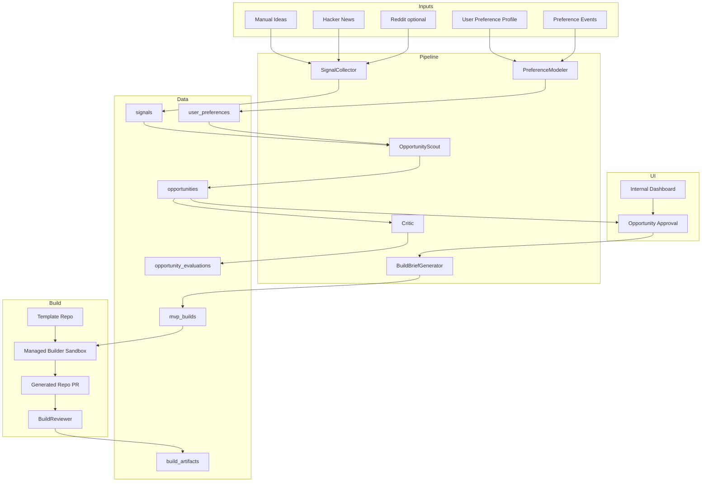

# Architecture

## Target Architecture

This is a target, not the current implementation.

The system should have four separable parts:

1. Opportunity pipeline: ingestion, normalization, preference modeling, ranking, and critique.
2. Database: durable storage for preferences, events, signals, opportunities, builds, and artifacts.
3. Managed builder adapter: simulated first, Antigravity later.
4. Dashboard: internal UI for profile setup, opportunity approval, build status, and artifact review.



## Pipeline Service

The pipeline service owns:

- Source clients and manual-input normalization.
- Preference profile and event modeling.
- Opportunity ranking.
- Critique and evaluation.
- Build brief generation after opportunity approval.
- Writes to Supabase.

Keep this runnable locally before wrapping it for Google ADK, Vertex AI Agent Engine, or Antigravity.

## Builder Adapter

The builder adapter should have two implementations:

- Simulated adapter: returns deterministic generated repo, PR, log, and artifact fixtures for local testing.
- Managed adapter: starts an Antigravity sandbox build from a stored build brief and template repo.

The managed adapter must record enough state to audit a build without assuming the generated repo lives inside Forge.

## Supabase

Supabase is the proposed system of record.

Primary tables:

- `user_preferences`
- `preference_events`
- `pipeline_runs`
- `signals`
- `opportunities`
- `opportunity_signals`
- `opportunity_evaluations`
- `mvp_builds`
- `build_artifacts`

Realtime should be added only where the dashboard actually needs live updates. Start with `mvp_builds` status changes and `build_artifacts` inserts.

## Dashboard

The dashboard should:

- Render and edit the explicit preference profile.
- Render ranked opportunities with evidence and critique summaries.
- Let a human approve one opportunity for build.
- Render build status, generated repo URL, PR URL, logs, README summary, checks, and run instructions.
- Subscribe to realtime build updates only after historical rendering works.

## Runtime Flow

1. User profile and preference events are loaded.
2. Manual ideas or public source signals are collected and normalized.
3. OpportunityScout ranks opportunities against the preference context.
4. Critic records feasibility, usefulness, scope, and evidence concerns.
5. Dashboard shows ranked opportunities.
6. Human approves one opportunity.
7. BuildBriefGenerator creates an internal build brief.
8. Forge creates an `mvp_builds` row with template repo, generated repo target, branch, and status.
9. Simulated builder runs locally first; managed Antigravity builder replaces it later.
10. BuildReviewer checks generated PR artifacts before the build is marked complete.

## Environment Variables

Expected categories:

```text
SUPABASE_URL=
SUPABASE_SERVICE_ROLE_KEY=
SUPABASE_ANON_KEY=
GOOGLE_CLOUD_PROJECT=
GOOGLE_CLOUD_LOCATION=
GOOGLE_APPLICATION_CREDENTIALS=
ANTIGRAVITY_API_KEY=
GITHUB_APP_ID=
GITHUB_APP_PRIVATE_KEY=
GITHUB_TEMPLATE_REPO=
REDDIT_CLIENT_ID=
REDDIT_CLIENT_SECRET=
```

Only `SUPABASE_URL` and `SUPABASE_ANON_KEY` should ever be considered for browser exposure, and only if Row Level Security policies support that usage.
