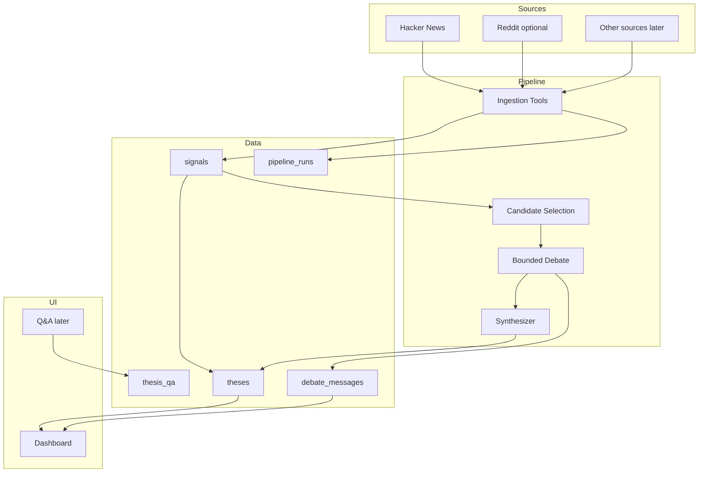

# Architecture

## Target Architecture

This is a target, not the current implementation.

The system should have three separable parts:

1. Pipeline: ingestion, normalization, candidate selection, debate, synthesis.
2. Database: durable storage for signals, runs, debate messages, theses, and Q&A.
3. Dashboard: read-only first, realtime second, interactive Q&A later.



## Pipeline Service

The pipeline service owns:

- Source clients.
- Signal normalization.
- Opportunity selection.
- Debate orchestration.
- Thesis synthesis.
- Writes to Supabase.

Keep this runnable locally before wrapping it for Google ADK or Vertex AI Agent Engine.

## Supabase

Supabase is the proposed system of record.

Primary tables:

- `pipeline_runs`
- `signals`
- `thesis_signals`
- `theses`
- `debate_messages`
- `thesis_qa`

Realtime should be added only where the dashboard actually needs live updates. Start with `debate_messages` inserts.

## Dashboard

The dashboard should:

- Render persisted thesis history.
- Render debate messages from the database on refresh.
- Subscribe to realtime inserts after historical rendering works.
- Keep role display clear enough to audit agent output.

## Runtime Flow

1. Manual or scheduled pipeline run begins.
2. Ingestion tools fetch public developer signals.
3. Signals are normalized, deduplicated, and persisted.
4. Pipeline selects one candidate opportunity.
5. Bull and Bear roles critique the opportunity for a fixed number of turns.
6. Each debate turn is inserted into Supabase.
7. Synthesizer writes the final thesis.
8. Dashboard reads records from Supabase and optionally subscribes to new debate messages.

## Environment Variables

Expected categories:

```text
SUPABASE_URL=
SUPABASE_SERVICE_ROLE_KEY=
SUPABASE_ANON_KEY=
GOOGLE_CLOUD_PROJECT=
GOOGLE_CLOUD_LOCATION=
GOOGLE_APPLICATION_CREDENTIALS=
REDDIT_CLIENT_ID=
REDDIT_CLIENT_SECRET=
```

Only `SUPABASE_URL` and `SUPABASE_ANON_KEY` should ever be considered for browser exposure, and only if Row Level Security policies support that usage.
