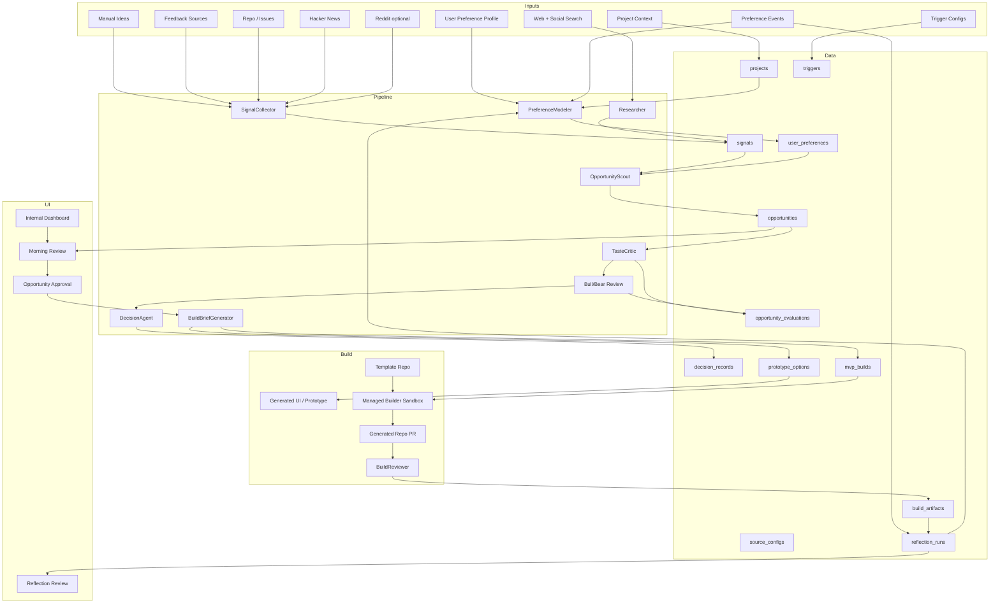

# Architecture

## Target Architecture

This is a target, not the current implementation.

The system should have four separable parts:

1. Product intelligence pipeline: project context, source configs, triggers, ingestion, research, preference modeling, ranking, critique, debate, and decision.
2. Database: durable storage for projects, sources, triggers, preferences, events, signals, opportunities, evaluations, decisions, builds, artifacts, and reflection proposals.
3. Managed builder adapter: simulated first, Antigravity later.
4. Reflection loop: reviews human feedback, ignored items, failures, build outcomes, and prior runs to propose memory, rubric, skill, prompt, and policy improvements.
5. Dashboard: internal UI for product setup, source configuration, morning review, opportunity approval, prototype review, build status, artifact review, and reflection proposals.



## Pipeline Service

The pipeline service owns:

- Project context, source configs, and trigger configs.
- Source clients, research outputs, and manual-input normalization.
- Preference profile and event modeling.
- Opportunity ranking.
- Taste critique, Bull/Bear evaluation, and Decision Agent output.
- Morning/product review assembly.
- Build brief generation after opportunity approval.
- Reflection proposal generation after feedback, ignored recommendations, or failures.
- Writes to Supabase.

Keep this runnable locally before wrapping it for Google ADK, Vertex AI Agent Engine, or Antigravity.

## Projects And Triggers

Forge supports two project modes:

- Connected product: an existing product with repo, feedback, issues, competitors, analytics summaries, or public search topics.
- New product or sample project: a theme, audience, manual idea, or generated sample context that Forge can research and prototype from.

Triggers are stored rules that decide when Forge should run. A trigger may be manual, scheduled, source-volume based, sentiment based, competitor-change based, or release-follow-up based. The trigger service invokes Forge runs; managed sandboxes are persistent execution environments when reused, not always-on workers.

## Builder Adapter

The builder adapter should have two implementations:

- Simulated adapter: returns deterministic generated repo, PR, log, and artifact fixtures for local testing.
- Managed adapter: starts an Antigravity sandbox build from a stored build brief and template repo.

The managed adapter must record enough state to audit a build without assuming the generated repo lives inside Forge.

## Reflection / Dreaming Loop

Reflection is Forge improving Forge, not Forge inventing more product ideas.

The reflection loop reviews:

- Human approvals, rejections, edits, and ignored recommendations.
- Generated prototype engagement.
- Build failures and BuildReviewer failures.
- Noisy triggers and low-value alerts.
- Repeated user corrections.

It may propose:

- Memory updates.
- Preference and source-weight adjustments.
- Scoring rubric changes.
- Prompt or skill file patches.
- Trigger threshold changes.
- New eval cases based on failures.

Low-risk memory and preference updates may be auto-applied in v1 if explicitly marked safe. Prompt, skill, policy, credential, destructive-action, or build-permission changes require review.

## Supabase

Supabase is the proposed system of record.

Primary tables:

- `user_preferences`
- `preference_events`
- `projects`
- `source_configs`
- `triggers`
- `pipeline_runs`
- `signals`
- `research_digests`
- `opportunities`
- `opportunity_signals`
- `opportunity_evaluations`
- `decision_records`
- `prototype_options`
- `mvp_builds`
- `build_artifacts`
- `reflection_runs`
- `reflection_proposals`

Realtime should be added only where the dashboard actually needs live updates. Start with `mvp_builds` status changes, `build_artifacts` inserts, and product review status changes.

## Dashboard

The dashboard should:

- Create or edit connected-product and new-product/sample projects.
- Configure sources and triggers.
- Render and edit the explicit preference profile.
- Render ranked opportunities with evidence, taste critique, Bull/Bear summaries, and Decision Agent recommendations.
- Render morning/product reviews with what changed, why it matters, and the recommended next action.
- Render generated UI or prototype options inline when available.
- Let a human approve one opportunity for build.
- Render build status, generated repo URL, PR URL, logs, README summary, checks, and run instructions.
- Render reflection proposals and let the human approve or reject review-required system updates.
- Subscribe to realtime build updates only after historical rendering works.

## Runtime Flow

1. Trigger starts a manual, scheduled, or source-driven Forge run.
2. Project context, source configs, user profile, and preference events are loaded.
3. Manual ideas, feedback, repo/issues, public source signals, or research results are collected and normalized.
4. OpportunityScout ranks opportunities against project and preference context.
5. TasteCritic records usefulness, coherence, differentiation, and product-quality concerns.
6. Bull and Bear evaluations run in parallel for the strongest candidates.
7. DecisionAgent recommends watch, research more, prototype, build, or reject.
8. Dashboard shows a product review with evidence, critique, decision rationale, and prototype options.
9. Human approves one direction for prototype or build.
10. BuildBriefGenerator creates an internal build brief.
11. Forge creates prototype records and/or an `mvp_builds` row with template repo, generated repo target, branch, and status.
12. Simulated builder runs locally first; managed Antigravity builder replaces it later.
13. BuildReviewer checks generated artifacts before the build is marked complete.
14. Reflection runs review human feedback and failures to propose safe improvements to memory, rubrics, skills, prompts, scoring, and triggers.

## Environment Variables

Expected categories:

```text
SUPABASE_URL=
SUPABASE_SERVICE_ROLE_KEY=
SUPABASE_ANON_KEY=
GOOGLE_CLOUD_PROJECT=
GOOGLE_CLOUD_LOCATION=
GOOGLE_APPLICATION_CREDENTIALS=
ANTIGRAVITY_API_KEY=
GITHUB_APP_ID=
GITHUB_APP_PRIVATE_KEY=
GITHUB_TEMPLATE_REPO=
REDDIT_CLIENT_ID=
REDDIT_CLIENT_SECRET=
```

Only `SUPABASE_URL` and `SUPABASE_ANON_KEY` should ever be considered for browser exposure, and only if Row Level Security policies support that usage.
