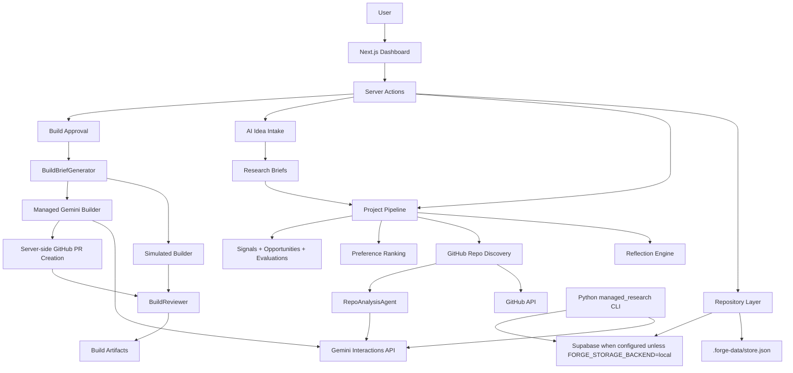

# Architecture

This document separates the architecture that exists now from the target architecture Forge is growing toward.

## Current Implementation

Forge currently has four working layers:

1. Dashboard app: `apps/dashboard`
2. Data repository layer: local JSON store plus optional Supabase access
3. Managed/repo agent integrations: GitHub discovery, Gemini/Antigravity repo analysis, managed builder
4. Managed research service: Python CLI for broader research and ingestion workflows



## Dashboard

The dashboard is a Next.js App Router app.

Current responsibilities:

- Project creation and archive behavior.
- Project review and opportunity cards.
- Opportunity detail with pass, watch, research, refine, and build actions.
- Project settings for sources, triggers, preferences, and reflection proposals.
- AI-led idea intake that stores conversation messages and compiles research briefs.
- GitHub connection panel for GitHub App installation metadata, server-side health checks, selected-repo listing, source-config linking, and optional GitHub user OAuth generated-repo targets.
- Scheduler controls for local trigger records.
- Build status and artifact display.
- Supabase Realtime project-status refresh for hosted Supabase authenticated sessions, with local polling fallback for running project runs, research tasks, and non-terminal builds.
- Manual project-page run-now for the visible queued research brief plus a secured pipeline worker endpoint for queued research-brief runs.

Server actions call local library modules directly for interactive dashboard writes. The idea panel can manually run a queued research-brief run after first loading the current project bundle and selecting only a visible queued/running research run. When the worker calls managed brief research, it forwards the project's owner/workspace scope in the payload and `X-Forge-User-Id` / `X-Forge-Workspace-Id` headers, and stores the managed service's echoed `request_scope` in run metadata. Background work also starts through explicit API routes such as `/api/pipeline/worker` and GitHub webhooks. The dashboard package includes `vercel.json` with a daily cron entry that calls `GET /api/pipeline/worker`; Vercel sends `Authorization: Bearer $CRON_SECRET` for secured cron invocations, and the worker also accepts `FORGE_PIPELINE_WORKER_SECRET` for non-Vercel callers. The worker selects queued research-brief runs with server-side storage access, then executes each run under the owning project's user/workspace scope before loading project data or writing results.

## Data Layer

The repository layer lives in `apps/dashboard/lib/db/repository.ts`.

It abstracts:

- `.forge-data/store.json` for local development.
- Supabase when `SUPABASE_URL` and `SUPABASE_SERVICE_ROLE_KEY` are configured, unless `FORGE_STORAGE_BACKEND=local` is set for an explicit fixture/local-render run.

The local store and Supabase tables are intended to share the same logical model. Supabase migrations live in `supabase/migrations`. Hosted schema setup is preflighted with `pnpm supabase:preflight -- --env-file apps/dashboard/.env.local` and applied with `pnpm supabase:migrate -- --env-file apps/dashboard/.env.local`, which requires a Postgres `SUPABASE_DB_URL`; service-role API keys are runtime credentials and cannot create missing tables. The preflight and migration helper verify that the DB URL matches the configured Supabase project ref unless a nonstandard target is explicitly accepted with `--skip-project-check`.

The dashboard repository layer maps the active runtime identity from a request Supabase Auth session first, then from `FORGE_USER_ID`, `FORGE_WORKSPACE_ID`, and `FORGE_AUTH_SUBJECT` as local/server-job overrides. Hosted requests can validate an `Authorization` bearer token, a configured `FORGE_AUTH_BEARER_COOKIE`, Forge's built-in `forge_supabase_access_token` cookie, or standard `sb-*-auth-token` cookies with Supabase Auth `/auth/v1/user`; if a cookie access token fails validation or has expired out of the browser jar, the request-session bridge can use the httpOnly Forge refresh cookie or a Supabase SSR refresh token to obtain a fresh access token for that request. The resulting subject resolves through `user_auth_identities` and then picks a workspace from `workspace_members` or an owned workspace. The `/signup`, `/login`, and `/auth/callback` pages provide a minimal email magic-link Forge account flow that clears the token-bearing callback URL, validates the returned Supabase access token, and then sets the httpOnly Forge cookies. GitHub is modeled as a connector after the Forge account exists, not as the primary identity provider. `FORGE_ALLOWED_EMAILS` and `FORGE_ALLOWED_EMAIL_DOMAINS` optionally gate private beta access before magic-link delivery and after token validation, so a direct Supabase session cannot bypass the Forge invite boundary. Hosted deployments should set `FORGE_REQUIRE_AUTH=1`; the app layout redirects unauthenticated dashboard requests to `/login` before loading project data under fallback identity, and repository identity resolution also rejects fallback identity for direct server-action/data calls unless `FORGE_ALLOW_SERVER_IDENTITY_WHEN_AUTH_REQUIRED=1` is set for a trusted background job. If a signed-in hosted user has no mapping yet, the first write provisions a default user/workspace mapping under that auth subject. New project, GitHub connection, idea conversation, brief, run, opportunity, and build records are written under that identity boundary. Hosted dashboard reads query visible projects first, then load project-owned child rows for those ids only; generic reads never include GitHub OAuth token rows and do not fall back to local JSON when a hosted workspace has no projects.

Primary records:

- `users`
- `workspaces`
- `workspace_members`
- `user_auth_identities`
- `projects`
- `github_connections`
- `source_configs`
- `triggers`
- `user_preferences`
- `preference_events`
- `pipeline_runs`
- `idea_conversations`
- `idea_messages`
- `research_briefs`
- `agent_tasks`
- `signals`
- `opportunities`
- `opportunity_signals`
- `opportunity_evaluations`
- `prototype_options`
- `mvp_builds`
- `build_artifacts`
- `reflection_runs`
- `reflection_proposals`

## Current Dashboard Pipeline

Code path:

```text
apps/dashboard/app/actions/pipeline.ts
  -> apps/dashboard/lib/pipeline.ts
```

Runtime:

1. Create a pipeline run.
2. Run reflection for the project.
3. Load project, source, trigger, preference, event, signal, opportunity, build, and artifact records.
4. If a repo URL exists, run connected repo discovery.
5. If no repo URL exists and an approved research brief exists, queue agent tasks for the brief.
6. If `FORGE_MANAGED_RESEARCH_URL` and `FORGE_MANAGED_RESEARCH_SECRET` are configured, send the approved brief to the managed research backend with bearer auth, then store returned source signals, candidate opportunities, and evaluation rows. Unauthenticated managed research API mode must be explicitly enabled with `FORGE_ALLOW_UNAUTHENTICATED_MANAGED_RESEARCH=1` for local throwaway development only.
7. If hosted auth-required mode is enabled and the managed research backend is not configured, fail the research run and return the brief to `approved` instead of creating brief-only market-research cards.
8. If local development is running without managed research, record the brief as a signal and create hypothesis records marked as needing source-backed research.
9. If no repo URL or approved brief exists, record new-product context signals only.
10. Replace project discovery records for the run.
11. Complete or fail the pipeline run with digest metadata.

Connected repo discovery is the current primary source-backed product-intelligence path. New-product intake now creates research briefs and can call the managed research backend for public-source collection plus Bull/Bear/Decision/Synthesizer-shaped evaluation when configured. Managed research responses include evaluator-role metadata so the dashboard can show which agent roles are complete and which are waiting for backend or role-specific evaluation output.

## AI Idea Intake

Code path:

```text
apps/dashboard/components/ideas/IdeaIntakePanel.tsx
  -> apps/dashboard/app/actions/idea.ts
  -> apps/dashboard/lib/ideas/idea-conversation.ts
```

Runtime:

1. The user talks naturally about a product direction.
2. Forge stores the message in `idea_messages`.
3. When `GEMINI_API_KEY` is configured, the idea compiler asks the next useful question or returns a strict JSON `research_brief`.
4. The dashboard shows the latest brief.
5. Human approval changes the brief status and launches a project pipeline run tied to `research_brief_id`.
6. The pipeline queues role-specific `agent_tasks`.

This is not a fixed questionnaire. The model controls the conversational next step, while Forge validates the durable brief shape before research can run.

## GitHub Connection Architecture

Forge now has a `github_connections` contract for GitHub App/OAuth metadata. Project GitHub source configs can reference a connection id instead of treating repo access as a pasted browser token.

The current dashboard can generate a GitHub App install URL when `GITHUB_APP_SLUG` is configured, accept the installation callback, store installation metadata plus the installation permission summary returned by GitHub, run a server-side health check that mints an installation token and returns only safe metadata, list installation repositories server-side, link a selected repo to the project source config, and exchange an installation id for a short-lived token during repo discovery, brief research GitHub collection, and PR creation. Runtime health also reads non-secret GitHub App permission metadata from `/app`, warns when `contents:write` or issue-read support is missing, and sends a signed GitHub `ping` event to `/api/github/webhook` when `FORGE_PUBLIC_APP_URL` is configured; `administration:write` is called out separately because it is needed only for organization generated-repo creation. It can also generate a GitHub App user-authorization URL when `GITHUB_APP_CLIENT_ID` is configured, exchange the callback `code` for a server-side user access token, refresh expiring user tokens, and use that user token for user-account generated repo creation. OAuth connections are not accepted for connected-product repo linking; the server-side repository-link policy requires an active GitHub App installation so normal repo access stays selected-repo/App scoped. GitHub App and OAuth rows for the same account stay separate because `github_connections` is keyed by user, provider, and account login. GitHub install/OAuth callback state is HMAC-signed with `GITHUB_STATE_SECRET`, falling back to `GITHUB_WEBHOOK_SECRET` when a dedicated state secret is not configured; signed state expires after 15 minutes by default and can be tuned with `GITHUB_STATE_MAX_AGE_SECONDS`. Local/dev raw project ids are still accepted when no state secret exists and `FORGE_REQUIRE_AUTH` is not enabled. Hosted auth-required project pages suppress project-scoped GitHub install/OAuth links until signed state is configured, so callbacks cannot silently lose their project binding. The callback route also checks for a signed-in Supabase session before loading project-scoped data when hosted auth is required, and redirect messages use callback-safe text rather than raw provider, token-exchange, encryption, or storage errors. Hosted GitHub OAuth token writes require `FORGE_TOKEN_ENCRYPTION_KEY`, and stored access/refresh tokens are encrypted at rest before they are written through the repository layer. For new-product projects, the GitHub App or OAuth callback automatically creates a project-scoped `github_generated_repo_target` source config, and settings can switch any active installation or authorized user connection to that generated-repo target without retyping ids. For new-product builds, Forge uses that source config as the generated-repo target; stored GitHub App connections can create PR branches and commit files only when their saved permissions include `contents:write`, and organization installations can create the generated repo only when the saved permissions also include `administration:write`. User-account repo creation requires GitHub App user OAuth. GitHub App user installations can target pre-created repos visible to the App, but the build brief marks them as pre-created targets instead of repo-creation capable. `FORGE_GITHUB_TOKEN`/`GITHUB_TOKEN` is ignored unless `FORGE_ALLOW_GITHUB_TOKEN_FALLBACK=1` is set for local dev and is always ignored when `FORGE_REQUIRE_AUTH=1`. Manual installation-id entry in settings is also local-dev only and is hidden plus rejected unless `FORGE_ENABLE_GITHUB_DEV_FALLBACK=1`; when used, it verifies the installation account before saving metadata. The signed `/api/github/webhook` endpoint verifies `X-Hub-Signature-256` with `GITHUB_WEBHOOK_SECRET` and applies installation lifecycle updates: deleted installations become `revoked`, suspended installations become `needs_reauth`, and restored/new-permission installations become `active`. Runtime `ping` probes are ignored after signature verification and do not mutate connection rows. When GitHub returns a missing-installation response during token minting, Forge also marks the connection `needs_reauth` so revoked/uninstalled apps do not continue to look active. The remaining production work is live proof against a real installed app plus final token rotation policy beyond refresh-token preservation.

General project settings do not mutate the GitHub repo URL. Repo changes are handled by the GitHub connection panel and `linkGitHubRepository`, which verifies the selected connection against the active project scope before updating the repo source config. In hosted auth-required mode, connected-product repo discovery also requires that active project-linked connection; local development can still inspect public repos from a raw URL, but hosted product research does not silently treat a public URL as a real GitHub connection.

Project settings also render a server-derived runtime-readiness panel for AI intake, managed research, pipeline worker, GitHub App, managed builder, and storage. The panel passes only statuses, fallback descriptions, missing environment variable names, non-secret setup URLs, non-secret proof labels, non-secret permission summaries, and health summaries to the browser; it must never include secret values. `FORGE_PUBLIC_APP_URL` is a readiness input for externally-called paths, not just display copy: hosted sign-in callbacks, GitHub callback/webhook setup, worker route proof, and GitHub OAuth setup remain partial or missing until the public app origin is configured. When `FORGE_PUBLIC_APP_URL` is configured, the panel derives the provider-console URLs for Supabase Auth redirects, GitHub setup/OAuth callbacks, GitHub webhooks, and the worker endpoint, then marks whether each URL is merely configured, needs a callback-flow completion, or has been live-proved by runtime health. The **Check live paths** action runs on the server: managed research pings `/health`, the pipeline worker accepts a bearer probe, GitHub App credentials call GitHub's app endpoint when configured, GitHub webhooks receive a signed non-mutating `ping` probe when a public app URL is configured, and Supabase storage verifies the required schema tables and columns when hosted storage is configured. Runtime health redacts configured secrets and common bearer/access/refresh token patterns from endpoint response bodies and thrown errors before returning details. The same runtime health contract is exposed as `pnpm smoke:runtime`; strict CLI smoke can validate a Supabase access token supplied via `FORGE_SMOKE_AUTH_BEARER` without logging the token. The CLI also derives a non-secret hosted setup handoff from non-ready health items so operators see concrete next actions, setup URLs, and remaining proof required for Supabase storage/Auth, managed research, the queued worker probe, GitHub App setup, and managed-builder PR readiness.

## Connected Repo Discovery

Code path:

```text
apps/dashboard/lib/github/repo-discovery.ts
  -> apps/dashboard/lib/github/repo-analysis-agent.ts
```

Runtime:

1. Parse the GitHub repo URL.
2. Fetch repo metadata, README, issues, and a bounded recursive tree.
3. Create repo and issue signals.
4. Build a fast repo scan.
5. Invoke the repo-analysis agent through the Gemini Interactions API.
6. Normalize project knowledge, opportunities, evidence links, and evaluations.

The managed agent receives the target repository as an attached source and must return strict JSON. Forge validates and normalizes the result before writing records.

## Build Architecture

Code path:

```text
apps/dashboard/app/actions/build.ts
  -> apps/dashboard/lib/build/builder.ts
  -> apps/dashboard/lib/build/brief.ts
  -> apps/dashboard/lib/build/managed-gemini-builder.ts
  -> apps/dashboard/lib/simulated-builder.ts
  -> apps/dashboard/lib/build/reviewer.ts
```

Runtime:

1. User approves an opportunity for build.
2. Forge creates a build brief.
3. Forge records an `approved` preference event.
4. Forge creates an `mvp_builds` row.
5. Adapter selection chooses managed builder when configured, otherwise simulated builder.
6. Managed builder returns PR metadata or a `files[]` bundle.
7. Forge creates GitHub repo/branch/PR server-side when files are returned. Existing-repo PRs require the linked GitHub App installation token; stored GitHub App connections must include `contents:write` before Forge treats them as PR-capable. Generated repo PRs use a GitHub App installation token for pre-created targets with `contents:write` and for organization repo creation when the saved App permissions also include `administration:write`; user-account generated repo creation uses GitHub App user OAuth, while user-account App installs are pre-created only. Managed builds fail fast before creating build rows when `GEMINI_API_KEY` is missing, no project-linked GitHub target can create or update the PR, or the target App permissions are insufficient; opportunity build readiness uses the same shared project build-path check so these blockers appear before the user clicks Build. `FORGE_GITHUB_TOKEN`/`GITHUB_TOKEN` is a local-dev fallback only when `FORGE_ALLOW_GITHUB_TOKEN_FALLBACK=1` and is ignored when `FORGE_REQUIRE_AUTH=1`.
8. BuildReviewer checks required artifacts.
9. Build status and artifacts are persisted.

Generated MVP code should live in generated repos or PRs, not in this repo.

## Reflection Architecture

Code path:

```text
apps/dashboard/lib/reflection/reflection-engine.ts
```

Reflection reads preference events and builds, then stores proposals. It currently generates deterministic proposals for preference, scoring, rubric, and eval-case updates.

Reflection improves Forge's behavior. It is not product research and must not create product opportunities.

## Managed Research Service

The Python service under `services/managed_research` is a parallel backend-oriented research path.

It can:

- Collect public source records.
- Seed topics.
- Run trend-to-research pipelines.
- Extract and validate structured JSON.
- Cluster opportunities.
- Run Bull/Bear/Synthesizer-style evaluation.
- Write validated rows to Supabase.

This service is not yet the dashboard's default Dream backend. The intended future architecture should either wire the dashboard to this service or consolidate the dashboard pipeline and Python service behind one shared contract.

## Target Architecture

The target system has separable services:

1. Product intelligence pipeline.
2. Database and realtime event stream.
3. Managed agent orchestration.
4. Managed builder adapter.
5. Reflection loop.
6. Product review dashboard.

```mermaid
flowchart LR
    Inputs["Project Context + Sources + Triggers"] --> Collect["SignalCollector"]
    Collect --> Research["Researcher"]
    Research --> Scout["OpportunityScout"]
    Prefs["Preferences + Events"] --> Model["PreferenceModeler"]
    Model --> Scout
    Scout --> Taste["TasteCritic"]
    Taste --> BullBear["Bull + Bear"]
    BullBear --> Decision["DecisionAgent"]
    Decision --> Review["Morning/Product Review"]
    Review --> Approval["Human Approval"]
    Approval --> Brief["BuildBriefGenerator"]
    Brief --> Builder["ManagedBuilder"]
    Builder --> PR["Generated Repo PR"]
    PR --> BuildReview["BuildReviewer"]
    BuildReview --> Reflection["ReflectionAgent"]
    Reflection --> Prefs
```



## Environment Variables

Dashboard and build paths:

```text
SUPABASE_URL=
SUPABASE_SERVICE_ROLE_KEY=
GEMINI_API_KEY=
GITHUB_TOKEN=
FORGE_ALLOW_GITHUB_TOKEN_FALLBACK=0
FORGE_ENABLE_GITHUB_DEV_FALLBACK=0
GITHUB_APP_ID=
GITHUB_APP_SLUG=
GITHUB_APP_PRIVATE_KEY=
GITHUB_WEBHOOK_SECRET=
GITHUB_STATE_SECRET=
GITHUB_STATE_MAX_AGE_SECONDS=900
FORGE_USER_ID=
FORGE_WORKSPACE_ID=
FORGE_IDEA_COMPILER_AGENT=
FORGE_MANAGED_RESEARCH_URL=
FORGE_MANAGED_RESEARCH_SECRET=
FORGE_ALLOW_UNAUTHENTICATED_MANAGED_RESEARCH=0
FORGE_MANAGED_RESEARCH_TIMEOUT_MS=
FORGE_BUILDER_ADAPTER=
FORGE_GEMINI_BUILDER_AGENT=
FORGE_REPO_ANALYSIS_AGENT=
FORGE_TEMPLATE_REPO_URL=
FORGE_GENERATED_REPO_OWNER=
```

Python managed-research paths may also use Google Cloud or managed-agent configuration documented in `services/managed_research/README.md`.

Service-role credentials, GitHub tokens, managed-agent API keys, and generated-repo credentials must stay server-side.

## Architecture Rules

- Prefer local, testable contracts before live managed-sandbox expansion.
- Keep source evidence, opportunities, evaluations, decisions, prototypes, build briefs, build logs, artifacts, and reflection proposals separate.
- Validate model outputs before durable writes.
- Do not create deterministic recommendation fallbacks that look like agent intelligence.
- Keep docs updated when architecture or runtime behavior changes.
